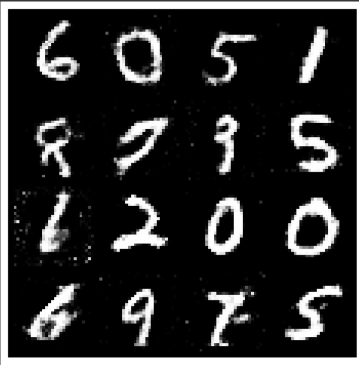

# 🌌 Vanilla GAN

An elegant and modular implementation of a **Vanilla Generative Adversarial Network (GAN)** using a **Multi-Layer Perceptron (MLP)** architecture in **PyTorch**. This project is dedicated to synthesizing realistic handwritten digits from the **MNIST** dataset, providing a clear, foundational blueprint for adversarial training.

## ✨ Features

* **Modular PyTorch Architecture:** Code is cleanly separated into dedicated files for models, training logic, data handling, and inference (`models.py`, `train.py`, etc.).
* **Classic MLP Architecture:** Uses fully connected layers for both the Generator and Discriminator, adhering to the original "Vanilla GAN" design.
* **MNIST Generation:** Successfully trains to generate novel $28 \times 28$ grayscale handwritten digits.
* **Optimized for Colab:** Proven to run efficiently, leveraging **NVIDIA T4 GPUs** on Google Colab.
* **Stable Training:** Achieved a competitive and stable adversarial balance throughout 50 epochs.

## 📁 Project Structure

The project is organized for clarity and maintainability:

| File | Purpose |
| :--- | :--- |
| `models.py` | Defines the **Generator (G)** and **Discriminator (D)** network architectures. |
| `datautils.py` | Handles **MNIST data downloading**, loading, and necessary PyTorch transformations. |
| `train.py` | Contains the **main training loop**, optimizer setup, loss calculations, and model saving. |
| `inference.py` | Script for **loading the saved generator** and producing new samples. |

---

## 🚀 Getting Started

### Prerequisites

You need Python and the following libraries installed:

```bash
pip install torch torchvision numpy matplotlib
````

### Running the Project

1.  **Clone the repository:**
    ```bash
    git clone <YOUR_REPO_URL>
    cd vanilla-gan
    ```
2.  **To Start Training (50 Epochs):**
    ```bash
    python train.py
    ```
3.  **To Generate New Samples (Inference):**
    ```bash
    python inference.py
    ```

-----

## 🧠 Architecture Details

### 1️⃣ Generator (G)

The Generator maps a 100-dimensional noise vector $\mathbf{z}$ to a flattened $28 \times 28$ image.

  * **Input:** Random noise vector $\mathbf{z} \in \mathbb{R}^{100}$
  * **Output:** Flattened image vector 784

| Layer Type | Input Dim | Output Dim | Activation | Notes |
| :--- | :--- | :--- | :--- | :--- |
| `Linear` | 100 | 128 | `ReLU` | |
| `Linear` | 128 | 256 | `ReLU` | |
| `Linear` | 256 | 512 | `ReLU` | |
| `Linear` | 512 | 1024 | `ReLU` | |
| `Linear` | 1024 | 784 | **`Tanh`** | Output range \[-1, 1] to match normalized data. |

### 2️⃣ Discriminator (D)

The Discriminator takes an image (real or fake) and outputs its probability of being real.

  * **Input:** Flattened image vector 784
  * **Output:** Single scalar probability $D(\mathbf{x}) \in [0, 1]$

| Layer Type | Input Dim | Output Dim | Activation | Notes |
| :--- | :--- | :--- | :--- | :--- |
| `Linear` | 784 | 1024 | `LeakyReLU(0.2)` | Flattens image input |
| `Linear` | 1024 | 512 | `LeakyReLU(0.2)` | |
| `Linear` | 512 | 256 | `LeakyReLU(0.2)` | |
| `Linear` | 256 | 1 | **`Sigmoid`** | Outputs probability. |

-----

## ⚙️ Training Details

  * **Loss Function:** **Binary Cross-Entropy (BCE) Loss** ($\text{nn.BCELoss}$).
  * **Optimizer:** **Adam** for both G and D.
      * Learning Rate (`lr`): $\mathbf{0.0002}$
      * Betas (`betas`): $\mathbf{(0.5, 0.999)}$
  * **Batch Size:** $\mathbf{128}$
  * **Epochs:** $\mathbf{50}$
  * **Hardware:** Trained on a **T4 GPU** using Google Colab.

-----

## 📊 Results and Stability Analysis

### Training Loss Analysis

The training achieved a competitive, stable balance, confirmed by the loss values recorded below.

| Epoch | D Loss (Discriminator) | G Loss (Generator) |
| :---: | :---: | :---: |
| **10** | 1.1943 | 1.0081 |
| **20** | 1.1554 | 1.1929 |
| **30** | 1.2948 | 1.2270 |
| **40** | 1.2091 | 1.4390 |
| **50** | **1.1515** | **0.8845** |

  * **Observation:** The $\mathbf{D\ Loss}$ consistently fluctuates around $\mathbf{1.1}$ to $\mathbf{1.3}$, which is above the ideal balanced loss of $\ln(2) \approx 0.693$.
  * **Conclusion:** This signifies that the **Generator quickly produced highly convincing images** that effectively fooled the Discriminator. The stable, high $\mathbf{D\ Loss}$ confirms the success and robust adversarial nature of the training process, avoiding the typical problem of collapse.

### Training Loss Plot

*(Please generate and insert the loss plot here to visualize the stability)*

### Final Generated Samples (Epoch 50)

The Generator successfully learned the distribution of the MNIST dataset, producing visually distinct and coherent digits.


-----

## 🤝 Contributing

Contributions, issues, and feature requests are welcome\!

## 📄 License

This project is open-sourced under the MIT License.

```
```